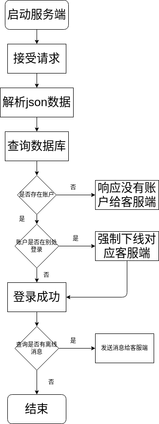
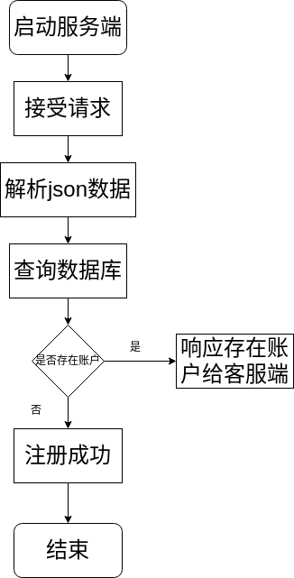
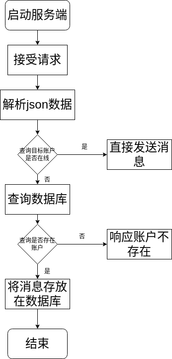

# 一个使用C++的聊天程序
## 登录请求
    使用nlohmann—json传递数据，数据格式
    {
        "type": "log in",
        "account": "", 
        "password": ""
    }
    使用dump()函数将json格式转化为string在尾部增加\r\n防止粘包
    TCP传输是可靠传输，一般不会有丢包、包乱序的问题
    服务端的login函数负责处理请求登录，流程图如下

## 注册请求
    {
        "type": "sign in",
        "account": "", 
        "password": ""
    }
    流程图如下

## 私法请求
    {
        "type": "private send",
        "source_account": "", 
        "destination_account": "",
        "message": ""
    }
    流程图如下

## 各个函数作用
    // 初始化服务器
    bool initial();

    // 连接mysql
    bool connect_with_MySQL();

    // 接受连接
    bool accept();

    // 客服端任务处理
    void process_client();

    // 关闭单个链接
    inline bool close_single(int &);

    // 处理关闭获取退出
    inline void handle_logout_or_close();

    // 查询数据库
    inline bool select_sql(const char *, const string &);

    // 检查账号是否存在
    bool account_exists(const std::string &account);

    // 更新数据库
    bool update_sql(const char *);

    // 强制退出其他客户端的登录
    bool force_logout_other_client(const string &account);

    // 0处理登陆
    void login(const json &);

    // 1处理注册
    void sign_in(const json &);

    // 2处理私发
    void private_send(const json &);

    // 3处理群法
    void group_send(const json &);

    // 4退出登录
    bool quitlog(string &);

    // 关闭服务器
    bool close();